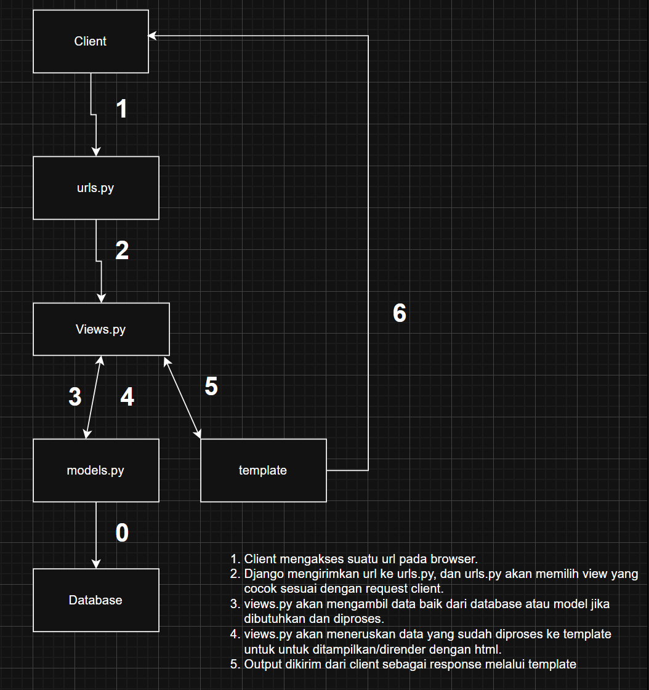

url deploy = https://rafsanjani41-monokotilshop.pbp.cs.ui.ac.id/

1. Jelaskan bagaimana cara kamu mengimplementasikan checklist di atas secara step-by-step (bukan hanya sekadar mengikuti tutorial).
saya mengimplementasikan checklist di atas secara step by step dengan menerapkan apa yang sudah saya pelajari baik di kelas maupun saat tutorial. Saya juga beberapa kali melakukan debug dengan melihat beberapa sumber referensi yang ada dan juga menanyakan kepada teman yang memahaminya lebih baik. Saya juga sering kali bereksperimen dengan kode saya, sehingga at the end kode saya berjalan sesuai dengan requirements yang ada.

1.Buat repo GitHub dan hubungkan origin, kemudian push awal (README, .gitignore). Gunakan branch master lalu push ke github

2.Buat folder proyek, aktifkan venv, tulis requirements.txt (django, gunicorn, whitenoise, psycopg2-binary, requests, urllib3, python-dotenv), lalu pip install -r requirements.txt. Memastikan lingkungan terisolasi dan siap untuk development maupun deploy. 

3.Jalankan django-admin startproject monokotil_shop . .Command ini menghasilkan manage.py dan paket proyek monokotil_shop/. 

4.Buat .env (development) berisi PRODUCTION=False. Buat .env.prod (production PWS) berisi kredensial Postgres dari ITF (DB_NAME, DB_HOST, DB_PORT, DB_USER, DB_PASSWORD, SCHEMA=tugas_individu, PRODUCTION=True).

5.Di settings.py, load_dotenv(), set PRODUCTION dari env, tambahkan ALLOWED_HOSTS = ["localhost","127.0.0.1"] dan tambahkan domain PWS pada ALLOWED_HOSTS. 
PBP Fasilkom UI

6.Jalankan migrasi awal & server dev dengan command python manage.py migrate lalu python manage.py runserver untuk memastikan proyek run di lokal (cek http://localhost:8000). 

7.Buat aplikasi main dengan command python manage.py startapp main, lalu tambahkan 'main' di INSTALLED_APPS. 

8.Di main/models.py, definisikan model dengan atribut sesuai ketentuan yang ada. alankan makemigrations + migrate setiap kali model berubah. 

9.Buat main/templates/main.html. Di main/views.py, buat show_main(request) yang menyusun context (app_name, name, class) dan render("main.html", context).

10.Buat main/urls.py dengan path('', show_main, name='show_main'). Di monokotil_shop/urls.py , include('main.urls') pada path '' sehingga root / menampilkan halaman utama. Jalankan server dan cek pada http://localhost:8000/. 

11.Siapkan .gitignore, pastikan .gitignore mengabaikan db.sqlite3, env/, .env*, dsb, agar file sensitif/berat tidak ter-track.  

12.Login ke pbp.cs.ui.ac.id, buat project dengan nama monokotilshop, buka tab Environs, paste isi .env.prod, set SCHEMA=tugas_individu & PRODUCTION=True.

13.Tambahkan URL PWS kamu ke ALLOWED_HOSTS (rafsanjani41-monokotilshop.pbp.cs.ui.ac.id), commit & push.
Jalankan “Project Command” pertama dari PWS, dan untuk update berikutnya cukup git push pws master. Tunggu status Running, lalu akses URL deploy (rafsanjani41-monokotilshop.pbp.cs.ui.ac.id).

2. Buatlah bagan yang berisi request client ke web aplikasi berbasis Django beserta responnya dan jelaskan pada bagan tersebut kaitan antara urls.py, views.py, models.py, dan berkas html.
bagan.png

3. Jelaskan peran settings.py dalam proyek Django!
settings.py memiliki peran utama dalam proyek django meliputi penghubungan dengan database dan pendefinisian jenis database yang akan digunakan, mendefinisikan aplikasi yang akan digunakan dalam proyek, menentukan urutan permintaan request, mengatur url dan template, menyimpan secret key dan mendefinisikan domain mana saja yang diizinkan untuk menjalankan proyek. Singkatnya, settings.py berguna untuk menghubungkan dan memastikan setiap komponen yang ada bekerja dengan benar dan sesuai dengan konfigurasi yang sudah ditetapkan

4. Bagaimana cara kerja migrasi database di Django?
Pertama, developer akan membuat migrasi.Saat perubahan terjadi pada models.py, dan perintah python manage.py makemigrations dijalankan, maka django akan membandingkan kode dari models.py dengan kode yang terakhir yang sudah tercatat pada migrasi dan melihat perubahan yang ada. Secara otomatis, django akan membuat sebuah berkas migrasi yang baru yang berisi sekumpulan intruksi untuk mengubah skema database yang sudah ada. Berkas ini tidak akan langsung mengubah databse, melainkan hanya mendokumentasikan perubahan yang sudah ada. Kedua, .developer menerapkan migrasi. Setelah developer menjalankan perintah python manage.py migrate, django akan membaca berkas yang sudah dibuat sebelumnya, dan menjalankan intruksi di dalamnya. 

5. Menurut Anda, dari semua framework yang ada, mengapa framework Django dijadikan permulaan pembelajaran pengembangan perangkat lunak?
Menurut saya, framework django dijadikan permulaan pembelajaran pada matkul PBP karena framework django lebih mudah untuk dipelajari dibandingkan dengan framework lainnya baik secara teknis maupun teori. Penggunaan bahasa python juga menjadi penyebabnya, karena jika dibandingkan dengan bahasa pemrograman lain, python yang paling mudah dan simple, sehiingga kita hanya perlu fokus pada function dan method pada django nya saja.

6. Apakah ada feedback untuk asisten dosen tutorial 1 yang telah kamu kerjakan sebelumnya?
Menurut saya,sejauh ini tutorialnya sudah sangat baik dan jelas.