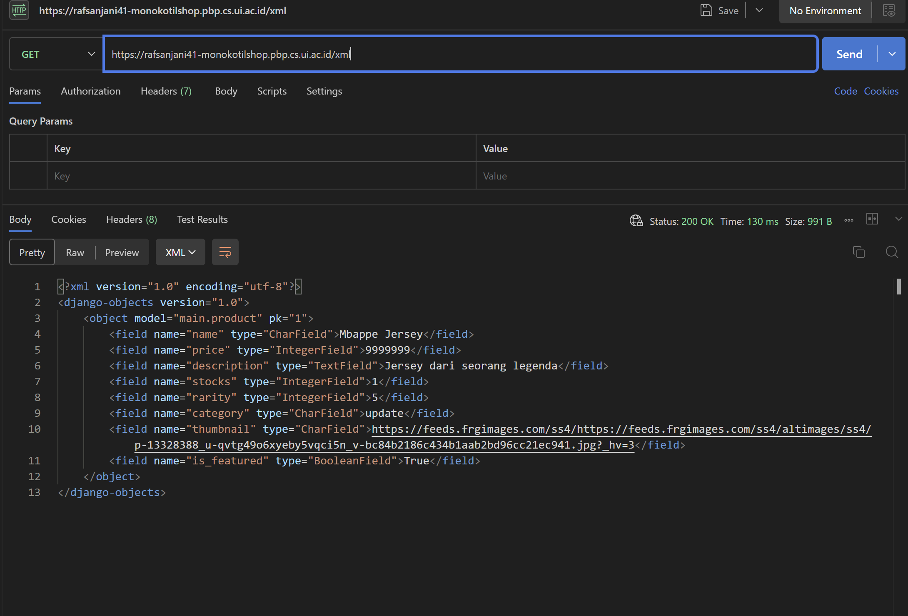
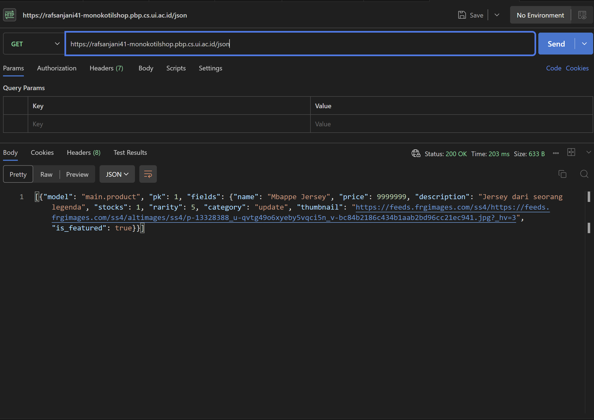
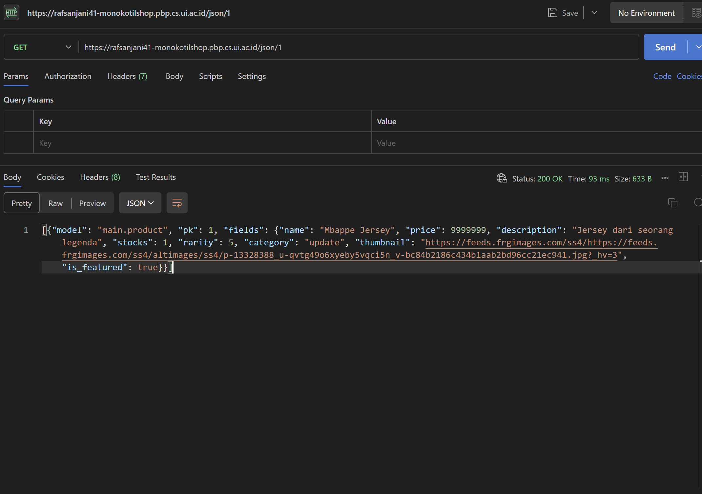
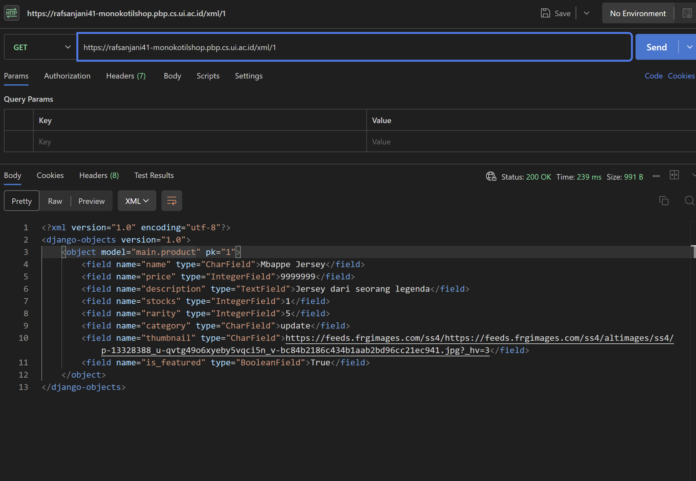

# Monokotil Shop

**URL Deploy**: [https://rafsanjani41-monokotilshop.pbp.cs.ui.ac.id/](https://rafsanjani41-monokotilshop.pbp.cs.ui.ac.id/)

---

## Tugas 2

### 1. Jelaskan bagaimana cara kamu mengimplementasikan checklist di atas secara step-by-step (bukan hanya sekadar mengikuti tutorial).
Saya mengimplementasikan checklist di atas secara step by step dengan menerapkan apa yang sudah saya pelajari baik di kelas maupun saat tutorial. Saya juga beberapa kali melakukan debug dengan melihat beberapa sumber referensi yang ada dan juga menanyakan kepada teman yang memahaminya lebih baik. Saya juga sering kali bereksperimen dengan kode saya, sehingga at the end kode saya berjalan sesuai dengan requirements yang ada.

1. Membuat repo GitHub dan menghubungkan origin, kemudian push awal (README, .gitignore). Kemudian saya menggunakan branch master lalu push ke github.  
2. Membuat folder proyek, aktifkan venv, mengisi `requirements.txt` (django, gunicorn, whitenoise, psycopg2-binary, requests, urllib3, python-dotenv), lalu `pip install -r requirements.txt`. Memastikan lingkungan terisolasi dan siap untuk development maupun deploy.  
3. Menjalankan `django-admin startproject monokotil_shop .`. Command ini menghasilkan `manage.py` dan paket proyek `monokotil_shop/`.  
4. Membuat `.env` (development) berisi `PRODUCTION=False`. Membuat `.env.prod` (production PWS) berisi kredensial Postgres dari ITF (`DB_NAME`, `DB_HOST`, `DB_PORT`, `DB_USER`, `DB_PASSWORD`, `SCHEMA=tugas_individu`, `PRODUCTION=True`).  
5. Di `settings.py`, `load_dotenv()`, saya set `PRODUCTION` dari env, tambahkan `ALLOWED_HOSTS = ["localhost","127.0.0.1"]` dan tambahkan domain PWS pada `ALLOWED_HOSTS`.  
6. Menjalankan migrasi awal & server dev dengan command `python manage.py migrate` lalu `python manage.py runserver` untuk memastikan proyek run di lokal (cek http://localhost:8000).  
7. Membuat aplikasi `main` dengan command `python manage.py startapp main`, lalu menambahkan `'main'` di `INSTALLED_APPS`.  
8. Di `main/models.py`, saya mendefinisikan model dengan atribut sesuai ketentuan yang ada. Kemudian saya menjalankan `makemigrations` + `migrate` setiap kali model berubah.  
9. Membuat `main/templates/main.html`. Di `main/views.py`, kemudian buat `show_main(request)` yang menyusun context (`app_name`, `name`, `class`) dan `render("main.html", context)`.  
10. Membuat `main/urls.py` dengan `path('', show_main, name='show_main')`. Di `monokotil_shop/urls.py`, `include('main.urls')` pada path `''` sehingga root `/` menampilkan halaman utama. Kemudian saya jalankan server dan cek pada http://localhost:8000/.  
11. Menyiapkan `.gitignore`, pastikan `.gitignore` mengabaikan `db.sqlite3`, `env/`, `.env*`, dsb, agar file sensitif/berat tidak ter-track.  
12. Saya login ke pbp.cs.ui.ac.id, buat project dengan nama monokotilshop, buka tab Environs, paste isi `.env.prod`, set `SCHEMA=tugas_individu` & `PRODUCTION=True`.  
13. Menambahkan URL PWS saya ke `ALLOWED_HOSTS` (`rafsanjani41-monokotilshop.pbp.cs.ui.ac.id`), commit & push. Kemudian menjalankan “Project Command” pertama dari PWS, dan untuk update berikutnya cukup `git push pws master`. Tunggu status Running, lalu saya mengakses URL deploy.  

---

### 2. Bagan Client Request dan Django Response
Bagan alur request client ke Django web app beserta hubungan `urls.py`, `views.py`, `models.py`, dan template HTML:  

`bagan.png`  


---

### 3. Jelaskan peran settings.py dalam proyek Django!
`settings.py` memiliki peran utama dalam proyek Django meliputi:
- Penghubungan dengan database dan pendefinisian jenis database yang akan digunakan.  
- Mendefinisikan aplikasi yang akan digunakan dalam proyek.  
- Menentukan urutan permintaan request.  
- Mengatur url dan template.  
- Menyimpan secret key dan mendefinisikan domain mana saja yang diizinkan untuk menjalankan proyek.  

Singkatnya, `settings.py` berguna untuk menghubungkan dan memastikan setiap komponen yang ada bekerja dengan benar dan sesuai dengan konfigurasi yang sudah ditetapkan.

---

### 4. Bagaimana cara kerja migrasi database di Django?
1. **Membuat migrasi**: Saat perubahan terjadi pada `models.py`, dan perintah `python manage.py makemigrations` dijalankan, Django akan membandingkan kode dari `models.py` dengan kode terakhir yang sudah tercatat pada migrasi. Django lalu membuat berkas migrasi baru berisi instruksi untuk mengubah skema database.  
2. **Menerapkan migrasi**: Saat developer menjalankan `python manage.py migrate`, Django membaca berkas migrasi dan menjalankan instruksi di dalamnya untuk mengubah database sesuai model terbaru.  

---

### 5. Mengapa Django dipilih sebagai framework awal pembelajaran?
Menurut saya, framework Django dijadikan permulaan pembelajaran pada matkul PBP karena:
- Django lebih mudah dipelajari dibanding framework lain, baik secara teknis maupun teori.  
- Django menggunakan bahasa Python, yang relatif simple dan mudah dipahami, sehingga fokus bisa lebih pada function dan method dari Django itu sendiri.  

---

### 6. Feedback untuk Asdos Tutorial 1
Menurut saya, sejauh ini tutorialnya sudah sangat baik dan jelas.  

---

## Tugas 3

### 1. Mengapa kita memerlukan data delivery dalam platform?
Karena platform butuh bertukar data antara client (browser) dan server (backend). Tanpa mekanisme data delivery, informasi tidak dapat dikirim/diterima dengan benar.  

Contoh: pada tugas ini, Django mengirim daftar product ke browser dalam bentuk HTML, JSON, atau XML. User bisa melihat list produk, menambahkan produk, dan mengambil data lewat endpoint XML atau JSON.  

---

### 2. Mana yang lebih baik antara XML dan JSON?
Menurut saya, JSON lebih baik daripada XML karena:
- Syntax JSON lebih readable dan efisien.  
- JSON lebih populer pada framework web modern.  
- JSON lebih compact, lebih mudah di-load dibandingkan XML yang lebih strict.  

---

### 3. Fungsi method is_valid() pada form Django
`is_valid()` digunakan untuk memvalidasi data yang dikirimkan pengguna melalui `forms.py` sesuai model yang sudah didefinisikan. Kita membutuhkan method ini untuk:
- Mencegah data atau input invalid masuk ke database.  
- Mencegah error saat `form.save()`.  

---

### 4. Mengapa kita membutuhkan csrf_token?
`csrf_token` adalah token unik untuk mencegah serangan **CSRF (Cross-Site Request Forgery)**.  

Jika tidak ada `csrf_token`, penyerang bisa menyalahgunakan request POST pada aplikasi.  
Contoh: pihak lain bisa menggunakan fungsi **add product** dan menambahkan data palsu.  

---

### 5. Implementasi Checklist Step-by-Step
1. Menambahkan 4 fungsi baru pada `views.py`: `show_xml`, `show_json`, `show_xml_by_id`, `show_json_by_id`.  
2. Membuat routing URL untuk fungsi baru pada `urls.py`.  
3. Memodifikasi `main.html` pada `/main/templates/` dengan tombol **add product** dan **detail**.  
4. Membuat `create_product.html` pada `/main/templates/` untuk form tambah produk.  
5. Membuat `product_detail.html` pada `/main/templates/` untuk detail produk.  
6. Push ke GitHub & PWS, lalu cek apakah output sudah sesuai.  

---

### 6. Feedback untuk Asdos Tutorial 2
Tidak ada, sudah sangat baik dan sangat membantu.  

---

### Dokumentasi Output
-   
-   
-   
-   

---

## Tugas 4

### 1. Apa itu Django AuthenticationForm? Jelaskan juga kelebihan dan kekurangannya.

`AuthenticationForm` adalah form bawaan Django (`django.contrib.auth.forms.AuthenticationForm`) yang digunakan untuk melakukan login dengan **username** dan **password**. Form ini akan memvalidasi input user terhadap sistem autentikasi Django dan mengembalikan objek user jika berhasil.

**Kelebihan**:
- tidak perlu membuat form login dari nol.  
- Terintegrasi langsung dengan sistem autentikasi Django.  
- Validasi password menggunakan mekanisme hashing bawaan Django.  
- Mendukung pesan error, internationalization (i18n), dan binding `request`.  

**Kekurangan**:
- Terbatas hanya pada autentikasi berbasis username & password.  
- Tidak ada field tambahan (misalnya “remember me”) kecuali di-*customize*.  
- Tampilan default polos, butuh styling lebih lanjut.  
- Tidak ada proteksi brute force/rate limiting bawaan, harus ditambahkan sendiri.  

---

### 2. Apa perbedaan antara autentikasi dan otorisasi? Bagaiamana Django mengimplementasikan kedua konsep tersebut?

- **Autentikasi (authentication)**: proses memastikan siapa yang akan login dan logout. Django menyediakan:
  - Fungsi `authenticate()`, `login()`, dan `logout()`.
  - Middleware `AuthenticationMiddleware` yang menambahkan atribut `request.user`.
  - Form bawaan seperti `AuthenticationForm` dan view `LoginView`.

- **Otorisasi (authorization)**: proses memastikan operasi yang dapat dilakukan setelah identitas diketahui. Django menyediakan:
  - Sistem `permissions` dan `groups` pada model `User`/`Group`.
  - Flag seperti `is_staff`, `is_superuser`.
  - Method `user.has_perm()` dan `user.has_module_perms()`.
  - Decorator dan mixin: `@login_required`, `PermissionRequiredMixin`, `UserPassesTestMixin`.

---

### 3. Apa saja kelebihan dan kekurangan session dan cookies dalam konteks menyimpan state di aplikasi web?

**Session (server-side)**  
- **Kelebihan**:  
  - Data disimpan di server sehingga data lebih aman untuk data sensitif.  
  - Bisa menyimpan struktur kompleks.  
  - Session bisa di-*invalidate* dari server (misalnya saat logout).  
- **Kekurangan**:  
  - Membutuhkan storage tambahan di server (DB/cache/file).  
  - Ada beban manajemen (expired session, scaling).  
  - Masih bergantung pada cookie `sessionid` untuk identifikasi.

**Cookies (client-side)**  
- **Kelebihan**:  
  - Implementasinya sederhana sehingga backend bisa tetap stateless.  
  - Cocok untuk data ringan .  
  - Tidak butuh storage server.  
- **Kekurangan**:  
  - Kapasitas terbatas (~4KB per cookie).  
  - Mudah dimanipulasi jika tidak ditandatangani/terenkripsi.  
  - Rentan XSS jika tidak diberi flag `HttpOnly`.  
  - Tidak cocok untuk menyimpan data sensitif.  

---

### 4. Apakah penggunaan cookies aman secara default dalam pengembangan web, atau apakah ada risiko potensial yang harus diwaspadai? Bagaimana Django menangani hal tersebut?

**Cookies tidak selalu otomatis aman secara default.** Terdapat beberapa risiko dari penggunaan cookies yakni:  
- **XSS** → cookie bisa dicuri jika tidak `HttpOnly`.  
- **Intersepsi jaringan** → cookie bisa bocor tanpa HTTPS.  
- **CSRF** → karena browser selalu mengirim cookie ke server secara otomatis.  

**Django menangani hal di atas dengan cara:**  
- Middleware CSRF protection + token ``.  
- Pengaturan keamanan cookie di `settings.py`:  
  - `SESSION_COOKIE_SECURE = True` (hanya lewat HTTPS).  
  - `SESSION_COOKIE_HTTPONLY = True` (default True, cegah akses via JS).  
  - `SESSION_COOKIE_SAMESITE = "Lax"`/`"Strict"` (kurangi CSRF).  
  - `CSRF_COOKIE_SECURE` dan `CSRF_COOKIE_HTTPONLY` untuk token CSRF.  
- Mendukung signed/encoded cookie agar tidak bisa dimodifikasi sembarangan.  
- Rotasi session key saat login (`login()` otomatis lakukan ini).  
- Memiliki password hashing kuat (PBKDF2, Argon2, dll).  


---


### 5.  Jelaskan bagaimana cara kamu mengimplementasikan checklist di atas secara step-by-step (bukan hanya sekadar mengikuti tutorial).

1. Pertama-tama saya menambahkan fungsi **register** pada `views.py`, membuat file `register.html`, kemudian menambahkan path URL dari register ke `urls.py`.  

2. Kemudian saya membuat fungsi **login** pada `views.py`, membuat file `login.html`, kemudian menambahkan path URL dari login ke `urls.py`.  

3. Selanjutnya saya membuat fungsi **logout** pada `views.py`, dan menambahkan path URL dari logout ke `urls.py`.  

4. Saya juga merestriksi akses dari menu utama dan product details agar hanya pengguna yang sudah terdaftar (logged in) yang dapat mengaksesnya.  

5. Saya menerapkan **cookies** agar data dapat tersimpan sebagai cookies, sehingga sesi login pengguna akan tetap tersimpan selama mereka belum melakukan logout.  

6. Terakhir, saya mengintegrasikan setiap produk yang dibuat ke satu pengguna, sehingga setiap produk akan selalu terhubung dengan pengguna tertentu.

---

## Tugas 5

### 1. Jika terdapat beberapa CSS selector untuk suatu elemen HTML, jelaskan urutan prioritas pengambilan CSS selector tersebut!

Jika terdapat beberapa *selector* CSS untuk suatu elemen HTML, *browser* akan menentukan *selector* mana yang akan diprioritaskan berdasarkan **spesifisitas** (*specificity*). Aturan dasarnya adalah, semakin spesifik sebuah *selector*, semakin tinggi prioritasnya.

Urutan prioritas dari yang **paling tinggi** ke **paling rendah** adalah sebagai berikut:

1.  **Inline Styles**: Atribut `style` yang ditulis langsung pada tag HTML.
    -   Contoh: `<div style="color: red;">`
2.  **ID Selector**: *Selector* yang menargetkan elemen berdasarkan atribut `id` uniknya.
    -   Contoh: `#main-header { ... }`
3.  **Class, Attribute, dan Pseudo-class Selectors**:
    -   **Class**: Menargetkan elemen dengan atribut `class` tertentu. Contoh: `.btn-primary { ... }`
    -   **Attribute**: Menargetkan elemen dengan atribut tertentu. Contoh: `input[type="text"] { ... }`
    -   **Pseudo-class**: Menargetkan *state* tertentu dari elemen. Contoh: `a:hover { ... }`
4.  **Type Selectors dan Pseudo-elements**:
    -   **Type**: Menargetkan semua elemen dari tipe tag HTML yang sama. Contoh: `h1, p, div { ... }`
    -   **Pseudo-element**: Menargetkan bagian spesifik dari sebuah elemen. Contoh: `p::first-line { ... }`

> Terdapat *rule* `!important` yang dapat mengesampingkan semua urutan prioritas di atas, namun penggunaannya sangat tidak dianjurkan karena dapat membuat kode CSS sulit untuk dikelola dan di-*debug*.

---

### 2. Mengapa responsive design menjadi konsep yang penting dalam pengembangan aplikasi web? Berikan contoh aplikasi yang sudah dan belum menerapkan responsive design, serta jelaskan mengapa!

*Responsive design* adalah konsep fundamental dalam pengembangan web modern yang bertujuan agar tampilan sebuah situs web dapat beradaptasi secara otomatis dengan berbagai ukuran layar perangkat, mulai dari *desktop*, tablet, hingga *smartphone*.

Konsep ini menjadi sangat penting karena:
-   **Aksesibilitas Multi-perangkat**: Pengguna mengakses internet dari berbagai perangkat. *Responsive design* memastikan pengalaman pengguna tetap optimal, mudah dibaca, dan mudah dinavigasi tanpa perlu melakukan *zoom* atau *scroll* horizontal.
-   **Meningkatkan SEO**: Google dan mesin pencari lainnya memprioritaskan situs yang *mobile-friendly*, sehingga situs yang responsif cenderung mendapatkan peringkat atas saat di-search.
-   **Meningkatkan Jangkauan Pengguna**: Dengan pengalaman yang baik di perangkat mobile, situs dapat menjangkau audiens yang lebih luas, terutama di era di mana akses internet via *smartphone* mendominasi.

**Contoh Aplikasi:**
-   **Sudah Menerapkan ()**: **Twitter/X**. Tampilannya berubah drastis dari versi *desktop* ke *mobile*. Di *desktop*, terdapat tiga kolom (navigasi kiri, *timeline* tengah, dan tren kanan). Di *mobile*, semua itu disederhanakan menjadi satu kolom utama, dan menu navigasi dipindahkan ke bagian bawah layar untuk kemudahan akses dengan jari.
-   **Belum Menerapkan ()**: **Website akademik atau pemerintahan yang lama**. Beberapa situs akademik atau pemerintahan yang lebih tua seringkali tidak responsif. Tampilannya dibuat dengan lebar tetap (*fixed-width*) untuk *desktop*. Ketika diakses melalui *mobile*, seluruh halaman akan terlihat sangat kecil, memaksa pengguna untuk melakukan *zoom* manual untuk membaca konten, sehingga memberikan pengalaman pengguna yang buruk.

---

### 3. Jelaskan perbedaan antara margin, border, dan padding, serta cara untuk mengimplementasikan ketiga hal tersebut!

Ketiga properti ini merupakan komponen inti dari **CSS Box Model**, yang mendefinisikan bagaimana elemen HTML dirender sebagai "kotak" dengan ruang di sekitarnya.

-   **Padding**: Ruang transparan yang berada **di dalam** *border*, yaitu antara konten elemen (teks/gambar) dengan *border* itu sendiri.
    -   *Implementasi*: `padding: 20px;` atau `padding-left: 10px;`

-   **Border**: Garis yang mengelilingi *padding* dan konten. *Border* bisa diatur ketebalan, gaya (solid, dashed), dan warnanya.
    -   *Implementasi*: `border: 2px solid #333;`

-   **Margin**: Ruang transparan yang berada **di luar** *border*. *Margin* berfungsi untuk memberikan jarak antara elemen tersebut dengan elemen lain di sekitarnya.
    -   *Implementasi*: `margin: 15px;` atau `margin-bottom: 25px;`

```css
.box {
  padding: 20px;
  
  border: 1px solid black;
  
  margin: 10px;
}
```

---
### 4. Jelaskan konsep flex box dan grid layout beserta kegunaannya!

**Flexbox** dan **Grid** adalah dua sistem *layout* modern di CSS yang digunakan untuk mengatur posisi dan perataan elemen dengan lebih efisien dibandingkan metode lama (seperti `float` atau `position`).

#### Flexbox (Flexible Box Layout)
-   **Konsep**: Didesain untuk *layout* **satu dimensi**, baik sebagai baris (*row*) maupun sebagai kolom (*column*).
-   **Kegunaan**: Digunakan untuk mengatur item-item di dalam sebuah *container*. Contohnya:
    -   Membuat menu navigasi horizontal yang itemnya terdistribusi rapi.
    -   Meratakan item (misalnya, sebuah tombol) secara vertikal di tengah *container*.
    -   Mengatur item-item dalam sebuah *card* agar sejajar, meskipun kontennya memiliki tinggi yang berbeda.
    -   `display: flex; justify-content: space-between; align-items: center;`

#### Grid Layout
-   **Konsep**: Didesain untuk *layout* **dua dimensi**, yaitu baris dan kolom secara bersamaan. Ini memungkinkan kontrol penuh atas penempatan elemen dalam sebuah petak (grid).
-   **Kegunaan**: Sempurna untuk tata letak halaman secara keseluruhan atau komponen yang kompleks. Contohnya:
    -   Membangun struktur utama halaman web (header, *sidebar*, *main content*, *footer*).
    -   Membuat galeri foto dengan kolom dan baris yang presisi.
    -   Mengatur *form* yang kompleks di mana label dan *input* harus sejajar dalam sebuah grid.
    -   `display: grid; grid-template-columns: 2fr 1fr; grid-gap: 20px;`

### 5. Jelaskan bagaimana cara kamu mengimplementasikan checklist di atas secara step-by-step (bukan hanya sekadar mengikuti tutorial)!
1. Pertama-tama saya mengimplementasikan fungsi untuk mengedit dan menghapus produk di views.py

2. Kemudian saya mengustomisasi halaman daftar product menggunakan css sesuai dengan ketentuan yang ada (menambahkan card_product.html, mengedit kode pada create_product.html, edit_product.html, dll)

3. menambahkan dua button untuk menghapus dan mengedit product yang ada.

4. Membuat navbar yang responsive untuk mobile dan desktop pada file navbar.html

5. Terakhir, saya mengubah design menjadi warna biru untuk tampilan halaman utamanya

6. ADD, COMMIT, dan PUSH semuanya kemudian saya deploy


